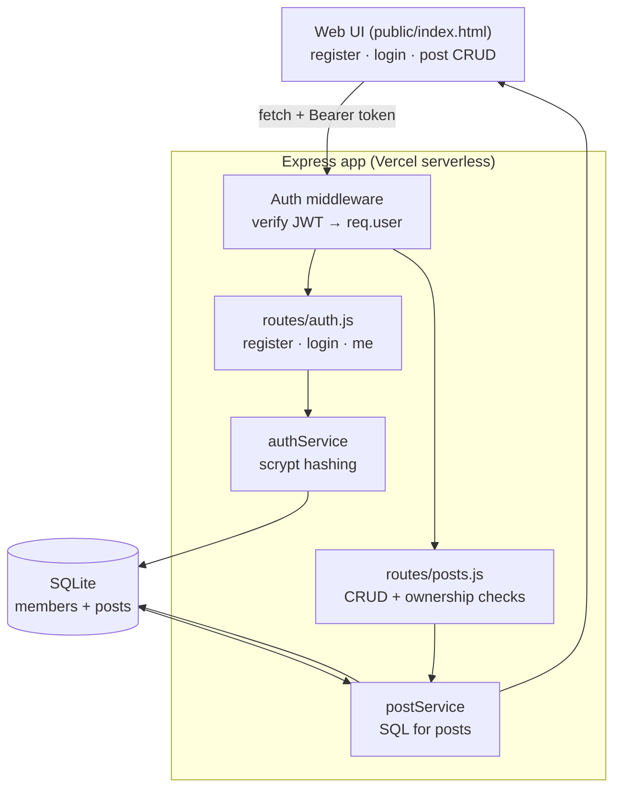

# CodeBox Board

A members' board for the CodeBox coding club. Members register and log in,
then post **announcements**, **events**, and **project shares** — and can edit
or delete their own posts. Built with **Express** + **SQLite**, with **JWT
authentication**.

## Requirements checklist

- ✅ **Running site** — a single-page UI served at `/`
- ✅ **Connected to a DB** — file-based SQLite via Node's built-in `node:sqlite`
- ✅ **User authentication** — register/login with hashed passwords (scrypt) and JWT
- ✅ **CRUD** — create / read / update / delete board posts, with per-owner permissions
- ✅ **Bonus: Vercel** — deploys as a serverless function

## Architecture



**How auth works:** on register/login the server verifies credentials and
returns a signed JWT. The browser stores it and sends it as
`Authorization: Bearer <token>` on every write. Middleware verifies the token
and attaches the member to the request; routes enforce that a member can only
modify their **own** posts.

## Project structure

```
index.js                  # starts the HTTP server
server.js                 # Express app: UI + API wiring
db.js                     # SQLite: members + posts tables
public/index.html         # the web UI (auth + board + CRUD)
routes/auth.js            # register / login / me
routes/posts.js           # posts CRUD (+ ownership checks)
services/authService.js   # password hashing + credential checks
services/postService.js   # SQL for posts
middleware/auth.js        # JWT sign + verify
vercel.json               # serverless routing + file bundling
```

## Run locally

```bash
npm install
npm start          # http://localhost:3000
```

Optional: set a real `JWT_SECRET` (a dev fallback is used otherwise).

```bash
cp .env.example .env      # then edit JWT_SECRET
```

## API

| Method | Route                 | Auth | Description            |
| ------ | --------------------- | ---- | ---------------------- |
| POST   | `/api/auth/register`  | —    | Create account → token |
| POST   | `/api/auth/login`     | —    | Log in → token         |
| GET    | `/api/auth/me`        | ✅   | Current member         |
| GET    | `/api/posts`          | —    | **Read** all posts     |
| GET    | `/api/posts/:id`      | —    | **Read** one post      |
| POST   | `/api/posts`          | ✅   | **Create** a post      |
| PUT    | `/api/posts/:id`      | ✅*  | **Update** a post      |
| DELETE | `/api/posts/:id`      | ✅*  | **Delete** a post      |
| GET    | `/api/teams`          | —    | **Read** all teams     |
| GET    | `/api/teams/:id`      | —    | **Read** one team      |
| POST   | `/api/teams`          | ✅   | **Create** a team      |
| PUT    | `/api/teams/:id`      | ✅*  | **Update** a team      |
| DELETE | `/api/teams/:id`      | ✅*  | **Delete** a team      |
| POST   | `/api/teams/:id/join` | ✅   | Join a team            |
| POST   | `/api/teams/:id/leave`| ✅   | Leave a team           |

`*` owner-only (returns `403` otherwise).

## Features

- **Board** — announcements, events, and project posts (full CRUD, owner-scoped).
- **Hackathon team finder** — create a team with a project idea, skills wanted,
  and a size cap; members join (until full) or leave live. Owner-only edit/delete.
- **Projects showcase** — an animated flip-card carousel of past projects.

## Deploy notes (Vercel)

- Set a `JWT_SECRET` environment variable in the Vercel project settings.
- The SQLite file is written to `/tmp` on Vercel (the only writable path),
  so data is per-instance and resets on cold starts. For durable, shared
  storage, swap SQLite for a hosted DB such as **Turso** (SQLite-compatible)
  or **Vercel Postgres**.
