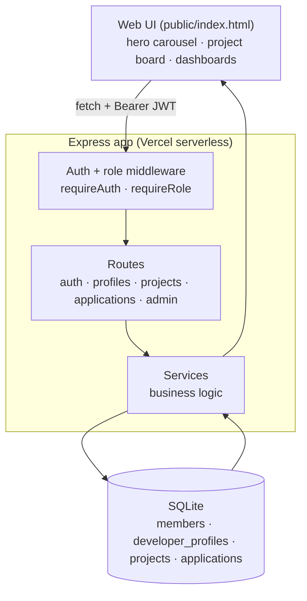

# CodeBox Match

A project-matching platform for a student engineering club. Members submit
project ideas, developers create profiles and apply to projects, tech leads
review applicants and build teams, and admins promote developers into tech
leads. Built with **Express** + **SQLite**, JWT auth, and role-based access.

## Requirements checklist

- ✅ **Running site** — a dark, glassy single-page app served at `/`
- ✅ **Connected to a DB** — file-based SQLite via Node's built-in `node:sqlite`
- ✅ **User authentication** — register/login, scrypt-hashed passwords, JWT
- ✅ **Role-based access** — `developer` / `tech_lead` / `admin`, protected routes
- ✅ **CRUD** — projects, profiles, applications (create/read/update/delete)
- ✅ **Bonus: Vercel** — deploys as a serverless function

## Roles

| Role | Can do |
|------|--------|
| **Developer** | create a profile, browse projects, apply / show interest |
| **Tech Lead** | everything above + review applicants, accept/reject/waitlist, set project status |
| **Admin** | everything + manage all users, promote/demote roles, delete any project |

Everyone signs up as a **developer**. An admin promotes members to tech lead.
A demo admin is seeded: **`admin` / `admin123`**.

## Architecture



Clean separation of concerns: **routes** handle HTTP, **services** hold business
logic, **db.js** is the data layer, **middleware/** does auth + role protection,
and secrets (`JWT_SECRET`) live in the environment.

## Data models

- **members** — id, username, name, role, passwordHash, createdAt
- **developer_profiles** — bio, skills, experienceLevel, availability, preferredRoles, githubUrl, portfolioUrl
- **projects** — title, description, category, techStack, neededRoles, difficulty, timeline, accent, status, createdBy, techLeadId
- **applications** — projectId, developerId, preferredRole, interestLevel, message, status

## API

| Method | Route | Auth | Purpose |
|---|---|---|---|
| POST | `/api/auth/register` | — | Sign up (as developer) |
| POST | `/api/auth/login` | — | Log in |
| GET  | `/api/auth/me` | ✅ | Current user (fresh role) |
| GET/PUT | `/api/profiles/me` | ✅ | My developer profile |
| GET  | `/api/profiles/:id` | — | A member's profile |
| GET  | `/api/projects` | — | All projects |
| POST | `/api/projects` | ✅ | Submit a project |
| PUT/DELETE | `/api/projects/:id` | ✅* | Manage a project |
| POST | `/api/applications` | ✅ | "I'm interested" |
| GET  | `/api/applications/mine` | ✅ | My applications |
| GET  | `/api/applications/project/:id` | ✅† | Applicants for a project |
| PUT  | `/api/applications/:id/status` | ✅† | Accept / reject / waitlist |
| DELETE | `/api/applications/:id` | ✅ | Withdraw (self or manager) |
| GET  | `/api/admin/users` | ✅ admin | All members |
| PUT  | `/api/admin/users/:id/role` | ✅ admin | Change a member's role |

`*` project creator, assigned tech lead, or admin. `†` the project's manager.

## Run locally

```bash
npm install
npm start          # http://localhost:3000
```

Set a real `JWT_SECRET` in production / Vercel env vars (a dev fallback is used
otherwise). On Vercel the SQLite file lives in `/tmp` (per-instance); for durable
shared storage swap in a hosted DB such as Turso or Vercel Postgres.
