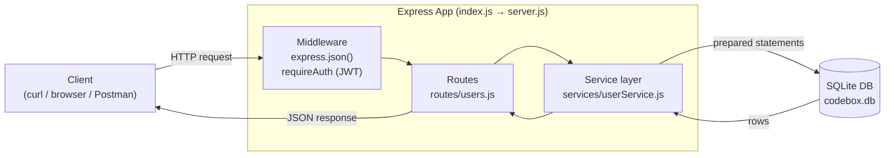

# CodeBox

A small REST API built with **Express** and a **SQLite** database, demonstrating
routing, database persistence, and full CRUD operations.

## Demo-day checklist

- ✅ **Routes** — organized with an Express `Router` (`routes/users.js`) plus
  top-level, health, and JWT-protected routes.
- ✅ **Connected to a DB** — a file-based SQLite database via Node's built-in
  `node:sqlite` (`db.js`). Data survives restarts; no external DB server needed.
- ✅ **CRUD operations** — Create, Read, Update, and Delete for the `users`
  resource.

## Architecture



**Layered design:** routes handle HTTP only, the service layer owns all data
logic, and `db.js` owns the database connection and schema. Each layer depends
only on the one below it.

## Project structure

```
index.js                 # Entry point — starts the HTTP server
server.js                # Express app: middleware + route wiring (exported)
db.js                    # SQLite setup: connection, schema, seed data
routes/users.js          # /api/users CRUD route handlers
services/userService.js  # Data logic (prepared SQL statements)
middleware/auth.js       # JWT verification for protected routes
scripts/generateToken.js # Helper to mint a test JWT
```

## Getting started

```bash
npm install
cp .env.example .env      # then set a real JWT_SECRET
npm start                 # server on http://localhost:3000
```

## API

| Method | Route             | Description                        |
| ------ | ----------------- | ---------------------------------- |
| GET    | `/`               | Welcome message                    |
| GET    | `/health`         | Health check                       |
| GET    | `/api/users`      | **Read** all users                 |
| GET    | `/api/users/:id`  | **Read** one user                  |
| POST   | `/api/users`      | **Create** a user                  |
| PUT    | `/api/users/:id`  | **Update** a user                  |
| DELETE | `/api/users/:id`  | **Delete** a user                  |
| GET    | `/api/me`         | Protected — requires a Bearer JWT  |

### Example requests

```bash
# Read all
curl http://localhost:3000/api/users

# Create
curl -X POST http://localhost:3000/api/users \
  -H 'Content-Type: application/json' \
  -d '{"name":"Jordan","email":"jordan@codebox.dev"}'

# Update
curl -X PUT http://localhost:3000/api/users/3 \
  -H 'Content-Type: application/json' \
  -d '{"name":"Jordan Lee"}'

# Delete
curl -X DELETE http://localhost:3000/api/users/3

# Protected route
npm run token                      # prints a short-lived JWT
curl http://localhost:3000/api/me -H "Authorization: Bearer <token>"
```

Responses use appropriate status codes: `201` on create, `204` on delete,
`400` for invalid input, `404` for a missing user, and `409` for a duplicate
email.
